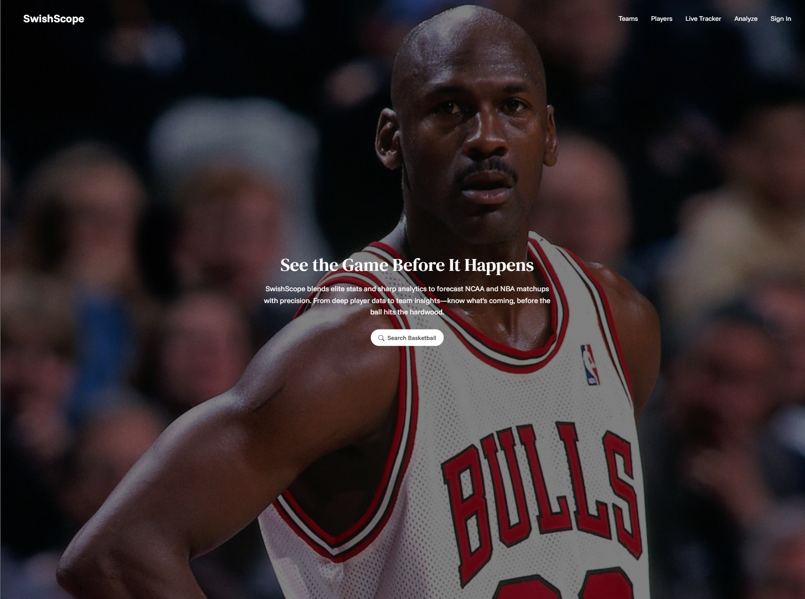
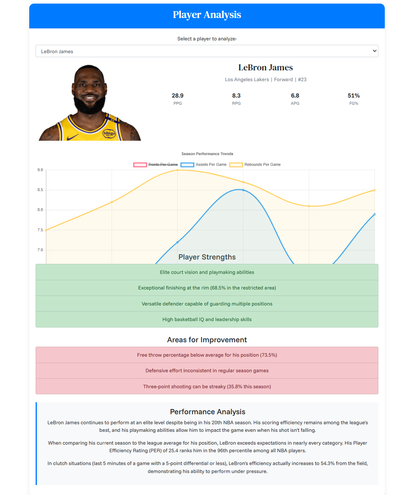
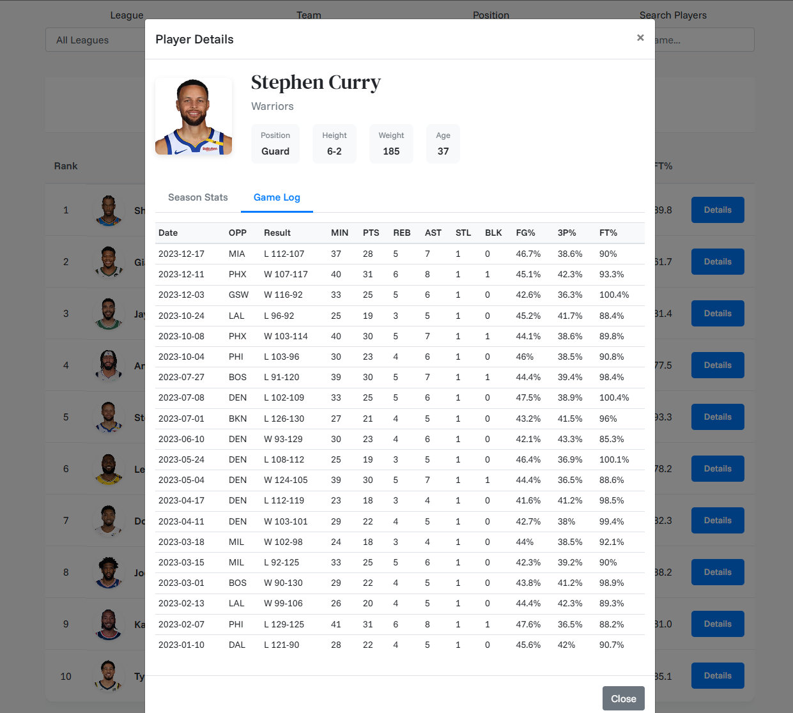
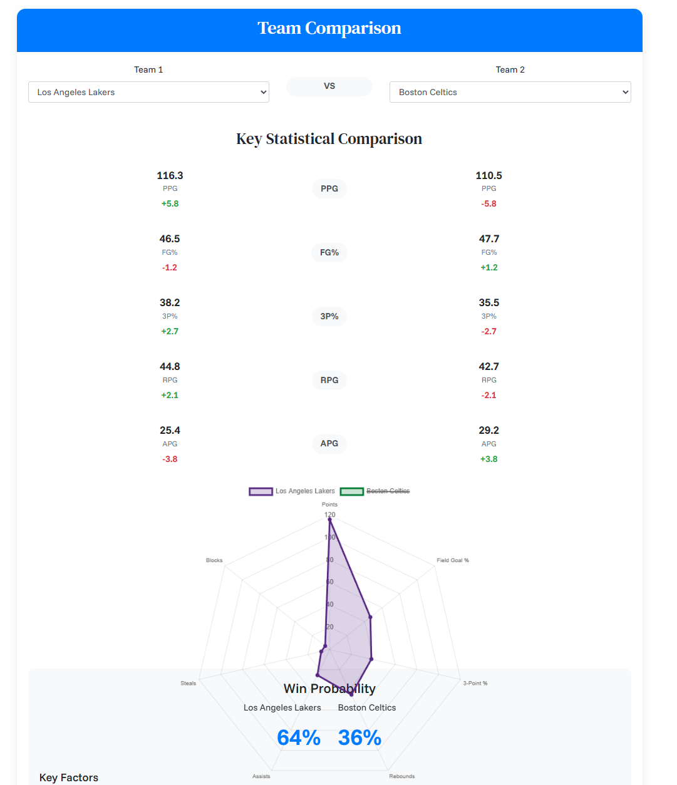

# SwishScope – NBA & NCAA Basketball Insights Platform

**SwishScope** is a full-featured, web-based platform that offers basketball enthusiasts a seamless experience to explore, analyze, and engage with NBA and NCAA teams, players, and matchups. From real-time statistics to advanced comparisons, this application brings fans closer to the game with precision stats and interactive visuals.

---

## Overview

SwishScope blends elite stats and modern analytics into an immersive platform that helps users:

- View detailed player and team statistics  
- Analyze matchups between teams and players  
- Predict outcomes and uncover hidden insights  

Whether you're a fantasy basketball fan, a data analyst, or a curious viewer, **SwishScope** provides a smart way to interact with the game.

---

## Key Features

### Team Stats and Filters

- Displays win/loss records, win percentages, conference, and division info  
- Filter teams by league or conference  
- Search teams using a live search bar  
- Dynamic team cards with logos and standings data  

---

### Player Dashboard

- Sortable, searchable player table featuring stats like PPG, RPG, APG, FG%, 3P%, and more  
- Filter by league, team, and position (PG, SG, SF, PF, C)  
- Tabs for viewing by category: Overall, Offense, Defense, Shooting, and Advanced  
- Modal popup for each player with full bio, image, current season stats, and game logs  
- Toggle between full season, last 10 games, and last game stats (feature in progress)  

---

### Analyze and Compare

- Compare two teams side-by-side using radar charts and stat breakdowns  
- View win probability predictions based on key performance indicators  
- Analyze player impact using dynamic chart visuals  

---

## Views and Pages

- `homepage.html`: Landing page with animated welcome and search intro  
- `teams.html`: Interactive team cards with league and conference filters  
- `players.html`: Player stats dashboard with modal details and game logs  
- `analyze.html`: Team and player comparison tools with charts and predictions (feature in progress)

---

## Architecture and Data Flow

- Flask backend hosts core data logic and API endpoints for players, teams, and game logs  
- Node.js server serves static assets and proxies API calls from the frontend to Flask  
- Game logs are generated using player season data and dynamically served via Flask endpoints  

---

## Scripts and Styling

- `app.py`: Flask backend that loads and processes player/team data from NBA API  
- `server.js`: Node.js Express server that serves the frontend and proxies data to Flask  
- `players.js`: Loads and filters players, renders tables, and manages detail modal logic  
- `teams.js`: Loads team data, handles league/conference filtering and search  
- `analyze.js`: Handles selection and stat comparison for teams and players (feature in progress)
- `styles.css`, `players.css`, `live.css`: Responsive styles and theme-based presentation  

---

## Technologies Used

- **Backend**: Python, Flask, NBA API  
- **Proxy Layer**: Node.js with Express and Axios  
- **Frontend**: HTML5, CSS3, JavaScript (ES6), Bootstrap  
- **Charts**: Chart.js for visualizing comparisons and trends  
- **Deployment Ready**: Works locally via Node + Flask combo  

---

## Summary

**SwishScope** is a complete basketball analysis tool built for fans, analysts, and developers alike. It combines real-time stats, predictive analysis, and clean visual design into a single interactive platform. Whether scouting players or comparing teams, SwishScope brings the power of basketball data directly to your screen.
